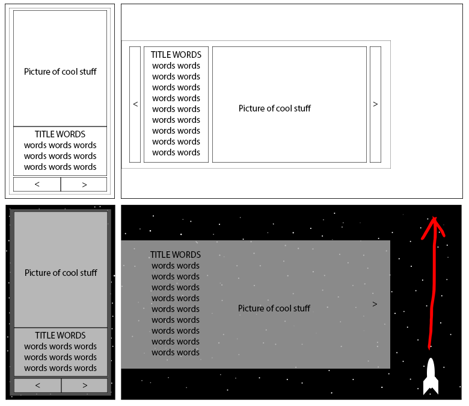

# CV / Portfolio Website

## Original Designs

The top half shows the wire frame of the full desktop site on the left and the mobile site on the right and bottom half shows the same designs but much more fleshed out.

The concept behind the site is a personal portfolio, or CV style. The shows a picture accompanied by a title and description. All three of these elements are in a slideshow allowing a single page site, with no scrolling but still full of content.

Originally only the desktop version was to include the spaceship animated to fly the height of the page, but during development it become apparent that it could be a feature of the mobile site as well.
***
## The Best Bits
### The Spaceship

A spaceship picture draw in Photoshop, exported to Illustrator and again exported in an SVG format. The fill color for each part of the ship, and the animation to make it fly up the page, are all defined in CSS.

### Stars.js

The background of the site is a large SVG "canvas" which is populated with 8000 SVG stars on load. This is achieved with JavaScript which also made it possible to randomize the X and Y coordinates of the stars within bounds every time the page loads.

### infoReader.js and data.js

data.js is a small file containing the basics of all content on the website: title, image, and text. Each of these three elements are defined for each slide in the slideshow and added to index. During their creation they are given the appropriate class names to correctly interact with slideshow.js.

### slideshow.js

A fully scalable piece of JavaScript which takes all the elements with class "slides" and switches between them in order. This is combined with a CSS animation which happens at the same time to literally *slide* each slide off of the screen.  

<!-- - a
- b
* a
`code snippet`
The file `star.js` is shite
cbvc bvcgnb
- [ ] eat
- [x] masterbate
*** -->
